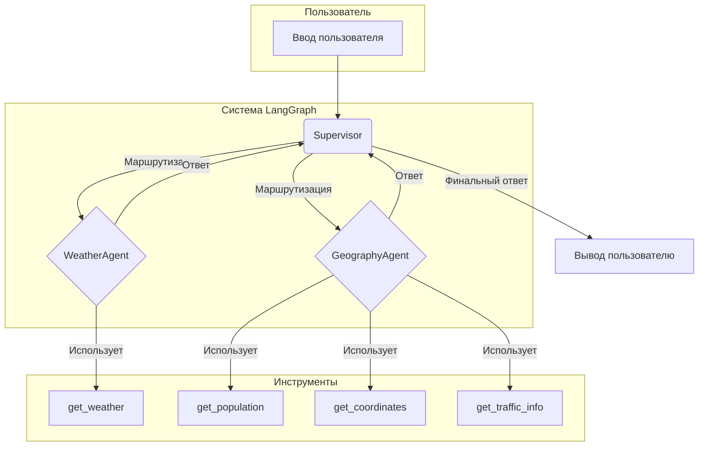
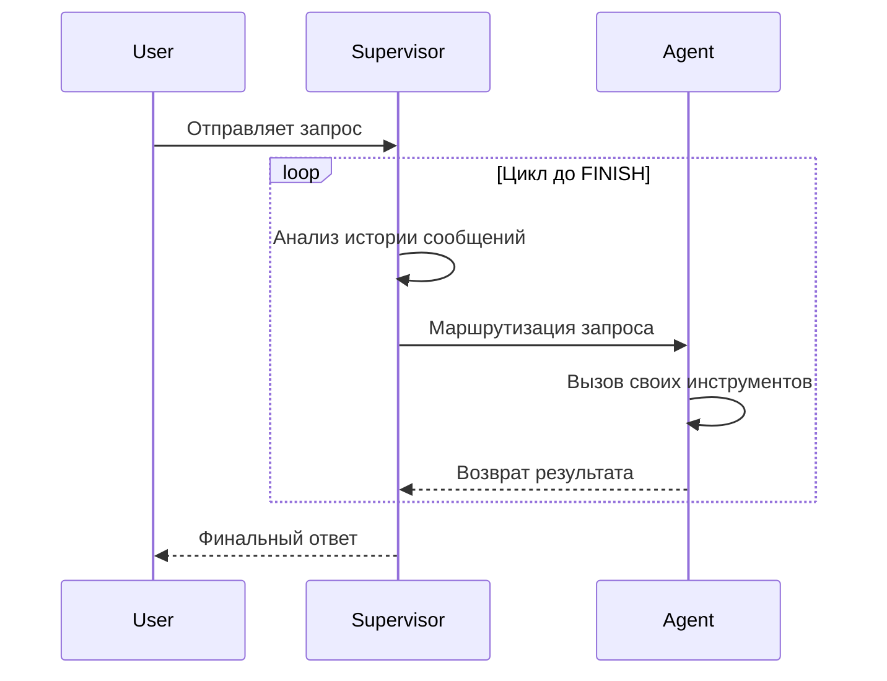
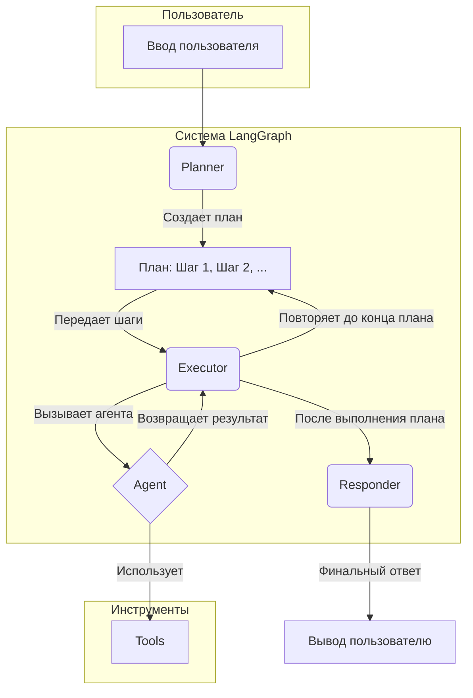
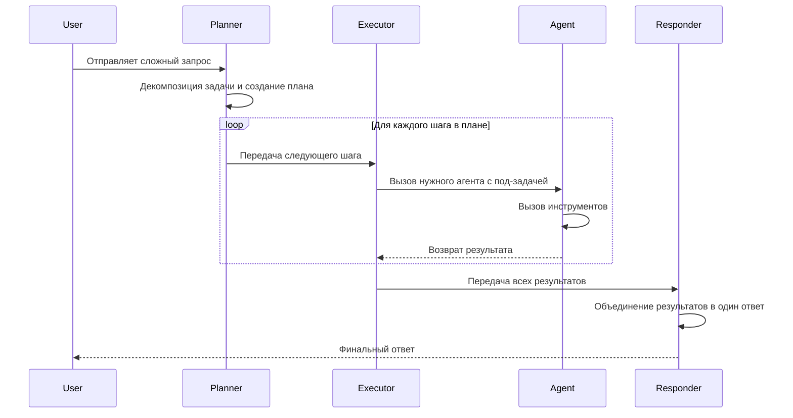

# 🤖 Демонстрация LangGraph: Супервизор и Агенты-Специалисты

Этот проект — учебное пособие для демонстрации работы **LangGraph**, фреймворка для создания сложных, многоагентных систем. В этом репозитории реализованы **два разных подхода** к управлению агентами, чтобы студенты могли сравнить их в действии.

## 🎯 Цель проекта

Показать студентам, как:
1.  **Создавать специализированные AI-агенты** для конкретных задач.
2.  **Оркестрировать их работу** с помощью двух разных типов "супервизоров": реактивного и планировщика.
3.  **Строить и компилировать графы** в LangGraph для управления потоком данных.
4.  **Наблюдать за процессом принятия решений** в реальном времени.

## ✨ Ключевые концепции

### 1. Агенты-Специалисты
- **`WeatherAgent`**: Знает всё о погоде. Использует `get_weather`.
- **`GeographyAgent`**: Эксперт по географии и демографии. Использует `get_coordinates`, `get_population`, `get_traffic_info`.

### 2. Два типа Супервизоров

В проекте реализованы два супервизора, демонстрирующие разные стратегии управления:

1.  **Реактивный Супервизор (`supervisor.js`):** "Мозг", который принимает решения пошагово. Он анализирует историю диалога и решает, какому специалисту **следующим** поручить запрос.
2.  **Супервизор-Планировщик (`planner_supervisor.js`):** "Стратег", который сначала декомпозирует сложную задачу на **полный план**, а затем последовательно выполняет каждый шаг этого плана.

---

## 🧠 Подход 1: Реактивный Цикл (Reactive Loop)

Этот подход использует циклического супервизора, который принимает решения на каждом шаге.

### Диаграмма архитектуры



### Диаграмма процесса (Цикл принятия решений)



-   **Преимущества:** Высокая гибкость, простота реализации.
-   **Недостатки:** Может совершать лишние шаги, так как не видит полной картины с самого начала.

---

## 🏛️ Подход 2: План Выполнения (Execution Plan)

Этот подход использует супервизора-планировщика, который сначала создает план, а потом выполняет его.

### Диаграмма архитектуры



### Диаграмма процесса



-   **Преимущества:** Более оптимальное выполнение, меньше лишних вызовов LLM.
-   **Недостатки:** Менее гибкий, если один из шагов провалится. Требует более сложного промптинга для планировщика.

---

## 📂 Структура проекта

```
src/
├── agents/
│   ├── geography.js
│   └── weather.js
├── graph/
│   ├── supervisor.js          # Подход 1: Реактивный супервизор
│   └── planner_supervisor.js  # Подход 2: Супервизор-планировщик
├── tools/
│   ├── ... (инструменты)
├── console.js
└── main.js
.env
package.json
README.md
```

## 🚀 Быстрый старт

1.  **Установите зависимости:**
    ```bash
    npm install
    ```

2.  **Настройте API ключи:**
    - Скопируйте `.env.example` в `.env`.
    - Вставьте свой `OPENAI_API_KEY`.
    - Добавьте `WEATHERAPI_COM_KEY` со своим ключом от [WeatherAPI.com](https://www.weatherapi.com/) для получения реальных данных о погоде.

3.  **Запустите приложение:**
    ```bash
    npm start
    ```
    При запуске вам будет предложено выбрать, какого супервизора использовать:
    - **1: Реактивный**
    - **2: Планировщик**

    После выбора вы сможете вводить запросы в консоль. Для выхода введите `exit`.
