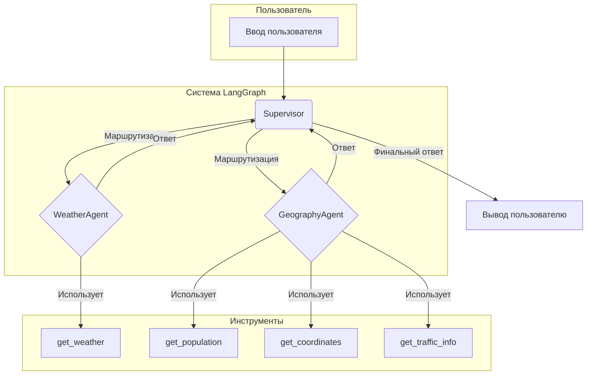
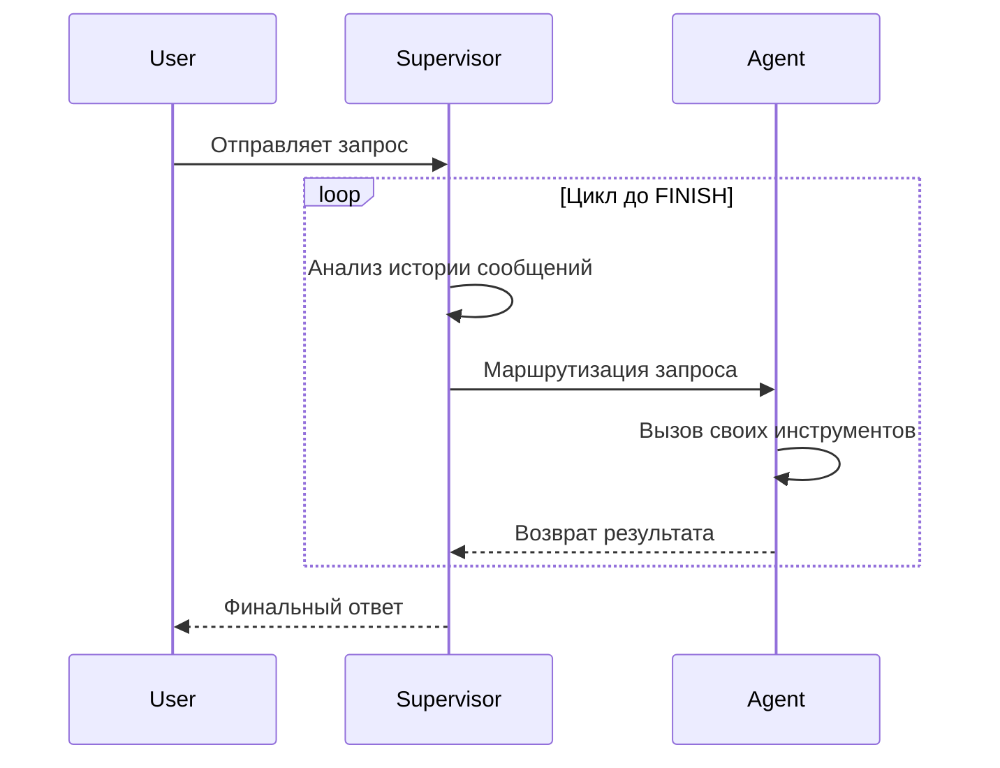

# 🤖 Демонстрация LangGraph: Супервизор и Агенты-Специалисты

Этот проект — учебное пособие для демонстрации работы **LangGraph**, фреймворка для создания сложных, многоагентных систем.

## 🎯 Цель проекта

Показать студентам, как:
1.  **Создавать специализированные AI-агенты** для конкретных задач.
2.  **Оркестрировать их работу** с помощью "супервизора".
3.  **Строить и компилировать графы** в LangGraph для управления потоком данных.
4.  **Наблюдать за процессом принятия решений** в реальном времени.

## ✨ Ключевые концепции

### 1. Агенты-Специалисты
- **`WeatherAgent`**: Знает всё о погоде. Использует `get_weather`.
- **`GeographyAgent`**: Эксперт по географии и демографии. Использует `get_coordinates`, `get_population`, `get_traffic_info`.

### 2. Супервизор
Это "мозг" системы. Он не выполняет задачи сам, а решает, какому специалисту поручить текущий запрос. Если задача требует нескольких шагов, он координирует передачу информации между агентами.

### 3. Граф (Graph)
Это визуальное представление нашего приложения.
- **Ноды (Nodes)**: Наши агенты и супервизор.
- **Рёбра (Edges)**: Связи, по которым передаются данные и управление.

## 🧠 Архитектура Графа: Реактивный Цикл, а не Предварительный План

Ключевое для понимания этого проекта — осознание того, что используемый граф является **реактивным графом состояний (State Graph)**, а не **графом предварительного планирования (Execution Plan)**. Это объясняет, почему агенты вызываются последовательно.

### Диаграмма архитектуры

Эта диаграмма показывает основные компоненты системы и их связи. Супервизор выступает в роли центрального узла, который направляет запросы к специализированным агентам, каждый из которых имеет доступ к своему набору инструментов.



### Как это работает?

1.  **Пошаговое принятие решений:** Супервизор не строит полный план заранее. Вместо этого он анализирует **текущее состояние диалога** (включая все предыдущие сообщения и ответы агентов) и принимает решение только об **одном следующем шаге**.

2.  **Циклический поток управления:** Процесс выглядит так:
    - Пользовательский запрос поступает к **Супервизору**.
    - Супервизор выбирает **Агента А** и передает ему управление.
    - **Агент А** выполняет свою работу, и его ответ добавляется в общую историю диалога.
    - Управление **возвращается к Супервизору**.
    - Супервизор снова анализирует *обновленную* историю и решает, что делать дальше: вызвать **Агента Б**, завершить работу (`FINISH`) или сделать что-то еще.

### Диаграмма процесса (Цикл принятия решений)

Эта диаграмма иллюстрирует циклический характер работы графа. Каждый раз после действия агента управление возвращается к супервизору для переоценки ситуации.



### Почему это важно?

-   **Гибкость:** Такой подход позволяет системе гибко реагировать на непредвиденные результаты. Если один агент не справился с задачей, супервизор может направить ее другому агенту или запросить уточнение у пользователя.
-   **Простота:** Реализовать пошаговый маршрутизатор проще, чем сложный планировщик, который должен предвидеть все возможные сценарии.

### Почему агенты вызывают все свои инструменты?

Это особенность реализации самих агентов в этом демо-проекте. Когда агент получает управление, он выполняет все инструменты, которые у него есть, чтобы собрать максимум релевантной информации по своей теме. Супервизор решает, **какой агент** работает, а агент решает, **какие инструменты** ему использовать.

## 📂 Структура проекта

```
src/
├── agents/
│   ├── geography.js  # Агент-географ
│   └── weather.js      # Агент-синоптик
├── graph/
│   └── supervisor.js   # Логика построения графа и супервизора
├── tools/
│   ├── coordinates.js  # Мок-инструменты
│   ├── population.js
│   ├── traffic.js
│   └── weather.js
├── utils.js            # Вспомогательные функции
└── main.js             # Точка входа в приложение
.env
.env.example
package.json
README.md
```

## 🚀 Быстрый старт

1.  **Установите зависимости:**
    ```bash
    npm install
    ```

2.  **Настройте API ключи:**
    - Скопируйте `.env.example` в `.env`.
    - Вставьте свой `OPENAI_API_KEY`.
    - (Опционально) Вставьте `OPENWEATHER_API_KEY` для реальных данных о погоде.

3.  **Запустите приложение:**
    ```bash
    npm start
    ```
    Теперь вы можете вводить запросы прямо в консоль. Для выхода введите `exit`.

## 📊 Что вы увидите в консоли

При запуске скрипт будет ждать ваших запросов. Для каждого запроса вы увидите подробное логгирование:

1.  **Анализ Супервизора**: Какие сообщения он анализирует.
2.  **Запрос к LLM**: Какой промпт отправляется модели для принятия решения.
3.  **Ответ от LLM**: Какой инструмент и с какими аргументами решила вызвать модель.
4.  **Решение Супервизора**: Какого агента он выбрал в итоге.
5.  **Работу Агента**: Какой инструмент был вызван и с какими данными.
6.  **Финальный ответ**: Ответ, который агент сгенерировал для пользователя.
